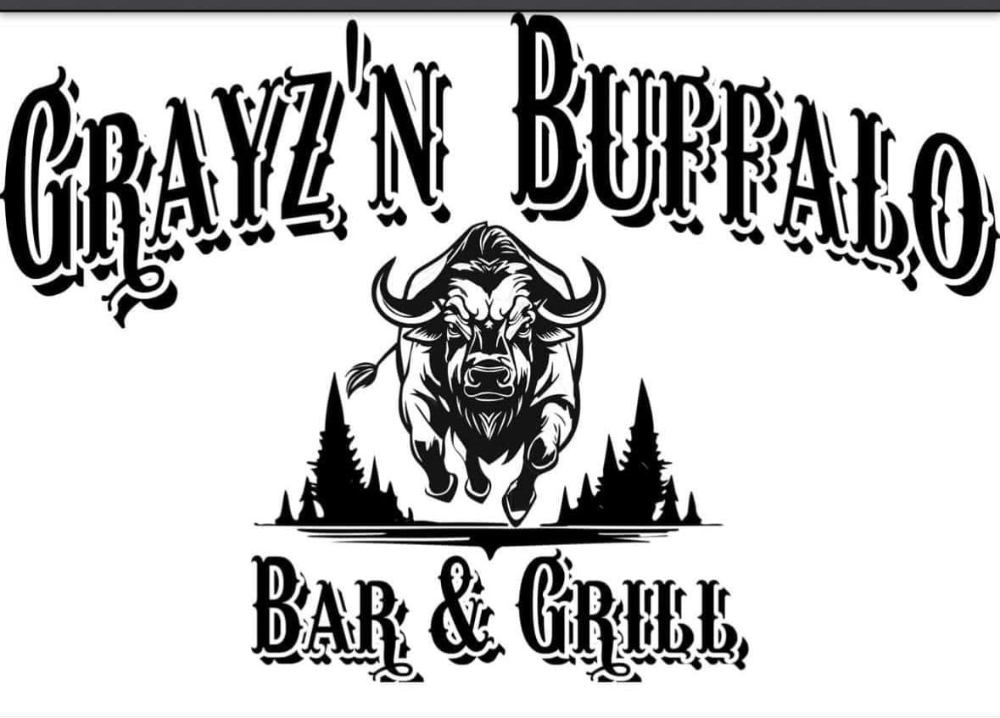
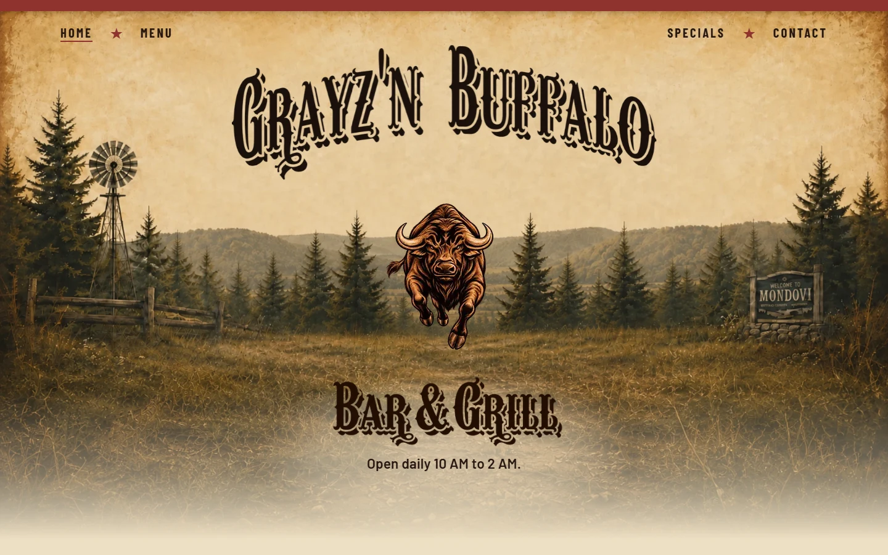
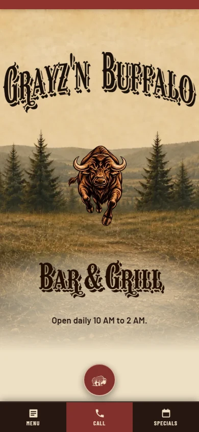
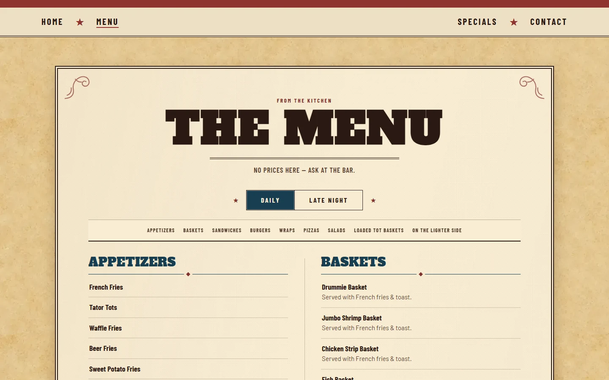
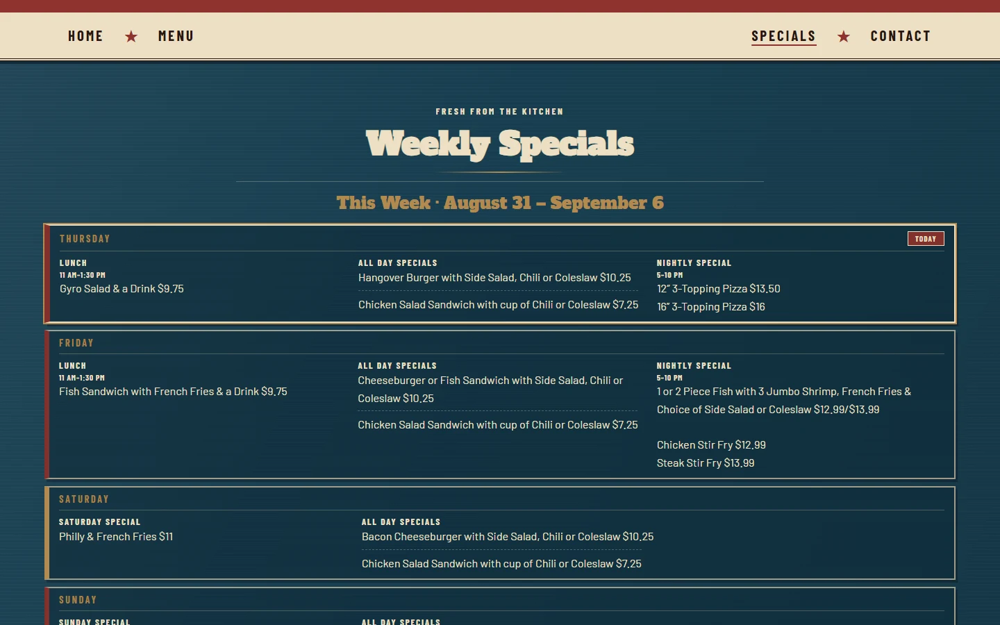

<div align="center">



# Grayz'n Buffalo Bar & Grill

**Production restaurant website and staff operations platform built with Astro and Cloudflare.**

[](https://astro.build/)
[](https://www.cloudflare.com/)


**[Live Site](https://grayznbuffalo.com)** · **[Portfolio](https://joshuawerlein.com)**

</div>

---

## Overview

Grayz'n Buffalo is a full-stack restaurant platform built for Grayz'n Buffalo Bar & Grill in Mondovi, Wisconsin.

The project combines a responsive public website with authenticated staff tools for maintaining menu content, weekly specials, photography, and other frequently changing business information without requiring staff to edit source code.

The application is built with Astro and Cloudflare services, using D1 for structured content, KV for authenticated sessions, R2 for managed media, Turnstile for abuse protection, and Resend for contact delivery.

A separate scheduled Cloudflare Worker integrates the restaurant's Facebook Page while keeping Facebook scripts out of visitors' browsers.

---

## Highlights

- Production Astro application deployed on Cloudflare
- D1-backed restaurant menu and weekly-special workflows
- Authenticated staff administration
- Recurring weekly-special templates
- R2-backed image management
- KV-backed administrative sessions
- Separate scheduled Facebook Graph API integration
- Failure-tolerant Facebook feed caching
- Turnstile-protected contact delivery through Resend
- Responsive desktop and mobile interfaces
- Keyboard-accessible dialogs and lightboxes
- Reduced-motion support
- Structured SEO, sitemap, Open Graph, and LocalBusiness data
- Staging-to-production deployment workflow

---

## Tech Stack

### Frontend

- Astro 5
- TypeScript / JavaScript
- HTML / CSS
- Server-rendered Astro pages
- Responsive WebP image delivery

### Cloud Platform

- Cloudflare Pages / Workers
- Cloudflare D1
- Cloudflare KV
- Cloudflare R2
- Cloudflare Turnstile

### Integrations

- Resend
- Facebook Graph API
- Google Maps
- Astro Sitemap

---

## Public Website

The customer-facing application includes:

- Responsive homepage
- Animated buffalo hero with reduced-motion fallback
- Database-backed restaurant menu
- Daily and late-night menu views
- Weekly specials
- Restaurant hours and location
- Google Maps integration
- Contact form
- Server-rendered Facebook feed
- Welcome photography
- Privacy and accessibility pages
- Mobile navigation
- Sitemap and production canonical URLs
- Open Graph metadata
- LocalBusiness structured data

Permanent menu items intentionally do not display prices. Promotional and weekly-special content may include pricing.

---

## Staff Administration

The protected `/admin` area allows restaurant staff to maintain operational content without modifying the application source.

### Menu Management

Staff can manage restaurant menu content stored in D1, including:

- Categories
- Menu items
- Descriptions
- Visibility
- Daily and late-night menu organization
- Associated item photography

### Weekly Specials

The specials system supports date-based weekly content rather than a hard-coded list.

Features include:

- Weekly records with defined date ranges
- Per-day special content
- Multiple special types per day
- Recurring weekly defaults
- Editable recurring templates
- Creation of future weeks
- Editing of previously saved weeks
- Preservation of intentionally blank fields
- Date and overlap validation

Recurring defaults populate new unsaved weeks while previously saved weeks remain unchanged.

### Welcome Photos

Staff can manage homepage photography through the administration interface.

Image metadata is stored with the application while media is managed through Cloudflare R2.

---

## Data Architecture

### D1

Cloudflare D1 stores structured application data including:

- Menu categories
- Menu items
- Weekly-special records
- Weekly-special day records
- Recurring special defaults
- Site settings
- Welcome-photo metadata

Schema changes are maintained through versioned SQL migrations.

### KV

Cloudflare KV is used for authenticated administrative sessions.

Sessions are generated server-side, expire automatically, and are delivered through secure cookies.

### R2

Cloudflare R2 stores managed site photography and cached Facebook media.

Public media access is routed through controlled application paths rather than exposing administrative storage operations directly.

---

## Facebook Feed Architecture

The Facebook integration is implemented as a separate Cloudflare Worker located in:

```text
workers/fb-feed/
```

It runs independently from the main Astro application.

### Refresh Flow

Every 30 minutes, the Worker:

1. Requests recent Page content through the Facebook Graph API.
2. Normalizes the post data required by the public website.
3. Stores the current feed state in Cloudflare KV.
4. Copies supported remote media into Cloudflare R2.
5. Prunes feed-owned media when appropriate.
6. Serves the resulting feed through a same-origin endpoint.

### Failure Handling

The integration is designed to fail soft.

If Facebook or another refresh dependency becomes temporarily unavailable, the Worker preserves the last known-good feed rather than replacing valid public content with a failed refresh.

The public page therefore does not depend on a live Facebook browser embed.

No Facebook SDK or feed script is required in the visitor's browser.

---

## Security

Security controls are implemented primarily on the server side.

Current protections include:

- Server-side administrative authentication
- KV-backed authenticated sessions
- Session expiration
- `HttpOnly` cookies
- `Secure` cookies
- `SameSite` cookie restrictions
- Cloudflare Turnstile
- Parameterized D1 queries
- Generated media object keys
- Restricted media routing
- Security response headers
- Non-indexable administrative routes
- Secrets stored in Cloudflare configuration rather than source control

Sensitive credentials, API tokens, and passwords must never be committed to this repository.

---

## Accessibility

Accessibility is integrated into the application rather than treated as a separate visual pass.

Implementation includes:

- Semantic controls
- Keyboard-operable dialogs
- Keyboard-operable image lightboxes
- Focus-visible states
- Focus management
- ARIA feedback where appropriate
- Reduced-motion support
- Static fallbacks for animated content
- Managed image alternative text
- Responsive navigation and layouts

---

## Performance

Performance work includes:

- Responsive WebP image variants
- Mobile-specific image delivery
- Lazy loading for non-critical media
- Explicit image dimensions to reduce layout shift
- Reduced-motion static fallbacks
- Cloudflare edge caching
- Server-rendered Astro output
- Same-origin caching of Facebook content and media
- Separate delivery strategies for desktop and mobile hero assets

---

## Project Structure

```text
grayzn-buffalo/
├── migrations/
│   └── ...                         # Versioned D1 schema migrations
│
├── public/
│   ├── images/
│   ├── buffalo-hero.webp
│   ├── buffalo-poster.webp
│   └── ...
│
├── src/
│   ├── layouts/
│   ├── lib/
│   └── pages/
│       ├── admin/
│       │   ├── index.astro
│       │   ├── menu.astro
│       │   ├── specials.astro
│       │   └── welcome-photos.astro
│       └── ...
│
├── workers/
│   └── fb-feed/
│       ├── worker.js
│       └── wrangler.toml
│
├── astro.config.mjs
├── schema.sql
├── wrangler.toml
└── README.md
```

---

## Local Development

### Requirements

- Node.js
- npm
- Wrangler / Cloudflare tooling for Cloudflare-backed local or remote operations

Install dependencies:

```bash
npm install
```

Start the Astro development server:

```bash
npm run dev
```

Create a production build:

```bash
npm run build
```

Preview using the configured Cloudflare environment:

```bash
npm run preview
```

---

## Cloudflare Bindings

The main application expects these Cloudflare bindings:

| Binding | Service | Purpose |
|---|---|---|
| `DB` | D1 | Menu, weekly specials, settings, and structured content |
| `SESSIONS` | KV | Administrative sessions |
| `PHOTOS` | R2 | Managed website photography and media |

Runtime secrets/environment variables include:

- `ADMIN_PASSWORD`
- `TURNSTILE_SITEKEY`
- `TURNSTILE_SECRET`
- `RESEND_API_KEY`
- `CONTACT_TO_EMAIL`

Secret values are configured in Cloudflare and are not stored in source control.

---

## Database

The production database is Cloudflare D1.

Schema evolution is maintained through the SQL migrations in:

```text
migrations/
```

The repository also contains:

```text
schema.sql
```

for the current schema/bootstrap state.

Production database operations should be performed deliberately against the configured remote database rather than by assuming local development data matches production.

---

## Deployment

The main application uses the Cloudflare configuration defined in:

```text
wrangler.toml
```

The canonical production hostname is:

```text
https://grayznbuffalo.com
```

A separate staging hostname is used for pre-production validation.

The Facebook feed Worker has its own configuration under:

```text
workers/fb-feed/
```

and runs on a 30-minute scheduled trigger.

---

## Development and Release Approach

Grayz'n Buffalo replaced the previous website for the business.

Development was performed against a separate staging domain so the new system could be validated without interrupting the existing public website.

Release validation has included:

- Public route smoke testing
- Administrative workflow testing
- Mobile viewport testing
- Accessibility testing
- Contact-form delivery testing
- SEO/indexing verification
- Security review
- D1 backup and restore validation
- Production binding verification
- DNS and custom-domain cutover planning

---

## Privacy and Third-Party Services

The public website uses Cloudflare infrastructure for application delivery and security.

Contact messages are processed through Resend.

Facebook content is retrieved server-side and cached by the application. The public feed does not require a Facebook browser embed or Facebook SDK.

See the live site's Privacy page for the current user-facing disclosure.

---

## Screenshots

The screenshots below show representative public views from the current staging deployment. Administrative screenshots are intentionally omitted because those routes require authentication and no credentials or private operational data are included in repository documentation.

### Homepage

#### Desktop — 1440 × 900



#### Mobile — 390 × 844



### Menu



### Weekly Specials



> Screenshots were captured from the staging deployment at `grazynbuffalo.com` prior to final production cutover. No credentials, customer submissions, API tokens, or other private operational information are shown.

---

## Copyright and Usage

This repository contains software developed for a commercial client and is publicly viewable for portfolio, demonstration, technical evaluation, and recruitment purposes.

No open-source license is granted by this README. Unless a separate license explicitly states otherwise, no permission is granted to copy, modify, redistribute, sublicense, sell, deploy, or create derivative works from the source code.

Grayz'n Buffalo Bar & Grill names, trademarks, logos, photography, menu content, and other business materials remain the property of their respective rights holders.

---

## Author

Developed and maintained by **Joshua Werlein**.

- Portfolio: [joshuawerlein.com](https://joshuawerlein.com)
- GitHub: [github.com/joshua-werlein](https://github.com/joshua-werlein)
- LinkedIn: [linkedin.com/in/joshua-werlein](https://linkedin.com/in/joshua-werlein)
